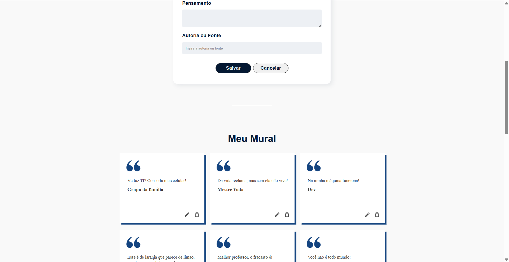

# HTTP CRUD — Thoughts

A CRUD application built with JavaScript to practice HTTP requests, asynchronous programming, API integration, and data management.

This project was developed as part of the JavaScript module within Alura's Front-End React learning path.



## 🚀 Features

- Create new thoughts.
- Read thoughts from an API.
- Edit existing thoughts.
- Delete thoughts.
- Search and filter thoughts.
- Dynamic rendering of data received from the API.
- Form validation and user interaction.
- Error handling for HTTP requests.

## 🌐 HTTP Requests & API

Unlike my previous Fokus project, which used LocalStorage for data persistence, this project communicates with an API through HTTP requests.

The application uses `fetch()` to perform CRUD operations:

- `GET` — retrieve thoughts.
- `POST` — create new thoughts.
- `PUT` — update existing thoughts.
- `DELETE` — remove thoughts.

This project was my first practical experience working with HTTP requests and asynchronous communication between a frontend application and an API.

## ⚡ Asynchronous JavaScript

The project introduced asynchronous JavaScript concepts used when communicating with external resources.

I practiced:

- Promises.
- `async/await`.
- `try/catch`.
- `fetch()`.
- Handling asynchronous responses.
- Error handling.

The `async/await` syntax was used to make asynchronous operations easier to read and organize.

## 🧩 Encapsulation

The API operations were organized inside an `api` object, encapsulating the logic responsible for communicating with the server.

This keeps HTTP-related operations separated from the rest of the application's interface logic.

For example, operations such as fetching, creating, updating, and deleting thoughts are handled by dedicated methods inside the API object.

## 🎨 Dynamic Rendering

The application dynamically creates and updates DOM elements based on the data received from the API.

The rendering logic is responsible for transforming JavaScript objects into visual elements on the page, including:

- Thought content.
- Authorship.
- Edit controls.
- Delete controls.
- Interactive elements.

This approach helped reinforce the relationship between application data and the DOM.

## 🧠 What I Practiced

This project expanded the concepts learned in previous JavaScript projects.

I practiced:

- DOM manipulation.
- Event handling.
- CRUD operations.
- HTTP requests.
- API integration.
- `fetch()`.
- Promises.
- `async/await`.
- `try/catch`.
- JSON.
- Object and array manipulation.
- Dynamic rendering.
- Form handling.
- Encapsulation.
- Error handling.
- Separation of responsibilities.

## 🔄 From LocalStorage to HTTP

The project represents the next step after my previous CRUD application.

**Fokus**

```
JavaScript
    ↓
CRUD
    ↓
LocalStorage
```

**HTTP CRUD**

```
JavaScript
    ↓
CRUD
    ↓
fetch()
    ↓
HTTP
    ↓
API
```

This transition helped me understand how frontend applications can work with data stored outside the browser instead of relying only on local persistence.

## 🛠️ Technologies

- HTML5
- CSS3
- JavaScript
- DOM API
- Fetch API
- HTTP
- REST API
- JSON
- Async/Await
- Promises
- Local development API

## 🎯 Next Steps

Continue developing my JavaScript and React skills by working with APIs, asynchronous data, component-based interfaces, and more complex application architectures.